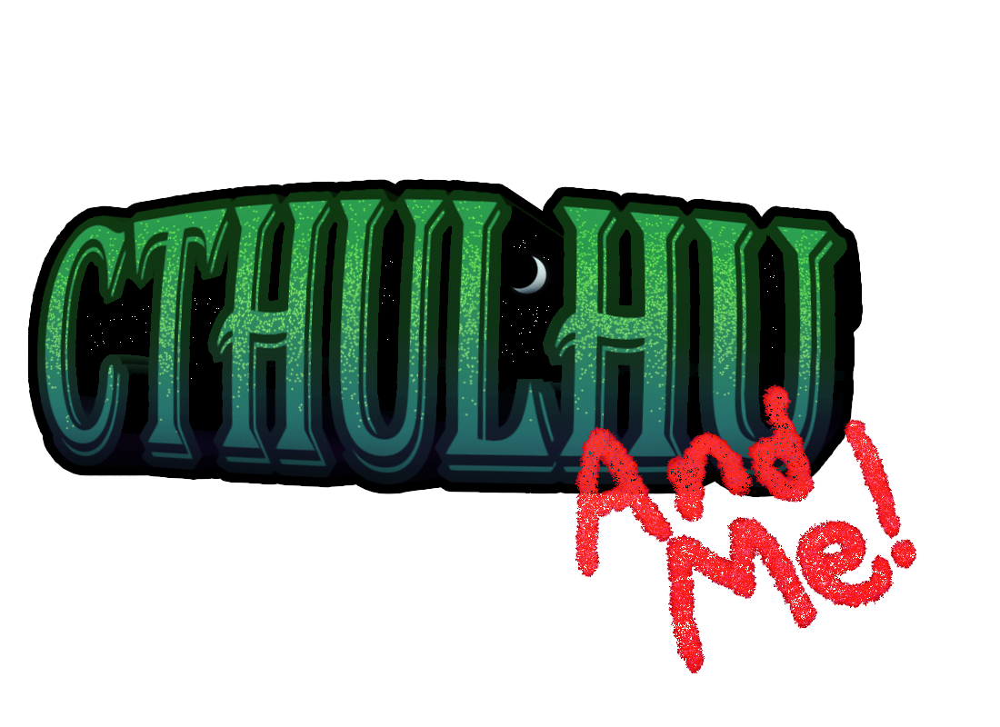

## Overview

**Cthulhu & Me** is a third-person pseudo-roguelike where the player progresses through semi-random levels and unlocks new weapons along the way. 



**Platform:** Windows

**Role:** Tech Designer and Scrum Master

**Engine:** Unity

**Date:** January 2025 - May 2025

## My Work

I worked as both a scrum master and a designer on this project. As a scrum master, I focused on helping my team learn and use agile, as well as leading meetings and presentations. We had a team of 12, the largest that any of us had worked with before. To assist my team and ensure everything ran smoothly, I checked in with everyone every week. We went over what they would be doing, when they could get it done, and if they had enough work for the sprint. Our project was very high in scope, so I would work with the team to restructure it to make it more feasible and ensure nobody was overworked or stressed. As a designer, I spent my time concepting enemies, implementing our artist's VFX, and helping our UI designer connect our player variables to our UI elements, but the system I spent the most time on was the grenade system. 

## In-Depth: The Rubber Ducky Grenade

The rubber ducky grenade is a weapon that the player gets towards the end of the game. It makes handling the small swarming enemies easy and is effective against the tanky bed-wielding Bed Monster. For the grenade itself, I wanted something that required a little more planning than just throwing it towards an enemy. So, everytime the grenade bounced, the explosion's radius would increase, and the time remaining would decrease. This encouraged players to use the environment with the grenade to kill more enemies quickly. To communicate this to the player, each time the grenade bounced, the rubber duck became redder and the explosion itself would be noticably larger.

## Learnings

Cthulhu & Me taught me how to assist a team to push forward to make our best work. I learned how to manage cutting features and how to get people to move other areas where help is needed. I also learned how to manage conflict within the team. At one point, the team was discussing whether we should keep jumping in the game. A couple people were really for keeping it, saying it would help with level varity, while some others were against it due to time and wanting to focus on other features. I told my team that we should let players decide and test how much they were using the jump. We ended up cutting it due to players not using it or not finding it useful, we did end up adding it back for a secret fun mode where the player could jump without any restriction.

## Team

**Artists:**
[Jiwon Park](https://www.linkedin.com/in/jiwon-park-7144592b5/) |
[Alanna Nguyen-Kenney](https://www.linkedin.com/in/alanna-nguyen-kenney/) |
[Harrison Green](https://www.linkedin.com/in/harrisonmgreen/) I
[Brendan O'Leary](https://www.linkedin.com/in/brendanroleary/)

**Designers:**
[Owen Grady](https://www.linkedin.com/in/owenrgrady/) |
[Max Schroeder](https://www.linkedin.com/in/max-schroeder-972b112b5/) |
[Alec Turgeon](https://www.linkedin.com/in/alec-turgeon/) |
[Kristos Iliopoulos](https://www.linkedin.com/in/kristos-iliopoulos/)

**Programmers:**
[Benjamin Trudell](https://www.linkedin.com/in/benjamin-trudell/) |
[Victor Diab](https://www.linkedin.com/in/victordiab/) |
[Liam Mercado](https://www.linkedin.com/in/liam-mercado-4a9b62359/)

**Sound Design:**
[Meghan Bennett](https://www.linkedin.com/in/meghan-bennett-sound/)

---

