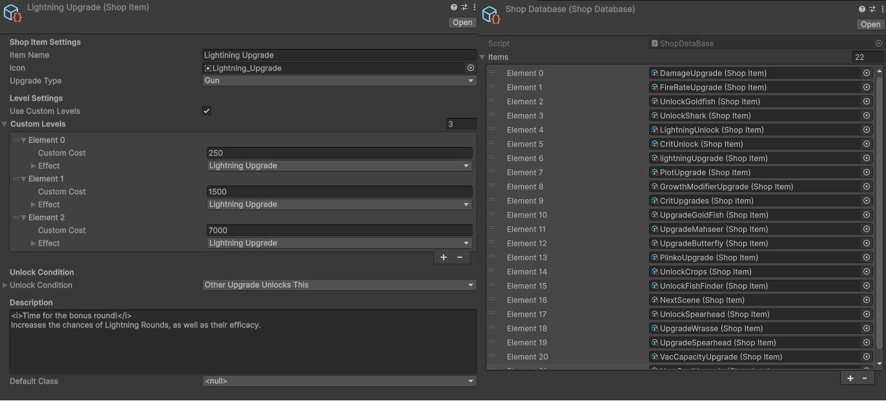

## Overview

**FincrementalOS** is a incremental game where the player shoots fish from a submarine and interacts with a fake operating system to gain money, upgrade, and play various minigames to become stronger and gather even more fish.

**Platform:** PC

**Role:** Lead Designer

**Engine:** Unity

**Date:** September 2025 - May 2026

## My Work

I spent my time working on various windows within the game. I've worked on the vacuum, email, data, and shop windows. These were made using Unity's UI Toolkit, a tool that works similarly to web development. My goal was to make our windows feel like they should fit into an OS by keeping a consistent visual style of a monochrome monitor of the 1970's and making them feel like they were built-in to the submarine system itself. 

I also needed to make sure the windows were easy to use and understand. Keeping buttons looking uniform and reacting when the player hovers their mouse over it helped testers get an easy grasp of the mechanics of each of the windows.

## In-Depth: The Shop

One of the systems I am very proud of is the shop, aka Pandora's Box. The shop is the main hub for player progression of various different parts of the game: Fish, Environments, and minigames. Since there was a lot of upgrades that need to be added over time or be changed, I needed to make system where our team could drag and drop upgrades into a list and have them immediately be accessible and playable. 

To do this, our programmers made two scriptable objects: Shop Items and the Shop Database. Our team will input all the data an upgrade needs into the Shop Item and place those items into the Shop Database. On runtime, I take that list and fill the shops with tabs depending on the types of upgrades, a list of buttons in each tab to show all available upgrades, and then a shop area with an upgrade icon, description, and a button that buys the upgrade if the player has the money for it.  

## Team

**Artists:**
[Emaleigh Hunter](https://www.linkedin.com/in/emaleigh-hunter-005761187/) |
[Alanna Nguyen-Kenney](https://www.linkedin.com/in/alanna-nguyen-kenney/) |
[Coleman Fitzgerald](https://www.linkedin.com/in/coleman-fitzgerald-03b828271/)

**Designers:**
[Owen Grady](https://www.linkedin.com/in/owenrgrady/) |
[Max Schroeder](https://www.linkedin.com/in/max-schroeder-972b112b5/) |
[Alec Turgeon](https://www.linkedin.com/in/alec-turgeon/) |
[Emma Zervanos](https://www.linkedin.com/in/emma-zervanos-85742229a/)

**Programmers:**
[Benjamin Emag](https://www.linkedin.com/in/benjaminemag/) |
[Victor Diab](https://www.linkedin.com/in/victordiab/) |
[Autumn Miranda](https://www.linkedin.com/in/autumn-miranda/)

**Sound Design:**
[Meghan Bennett](https://www.linkedin.com/in/meghan-bennett-sound/)

**Production:**
[Olivier Lorin](https://www.linkedin.com/in/olivier-lorin/)

---

