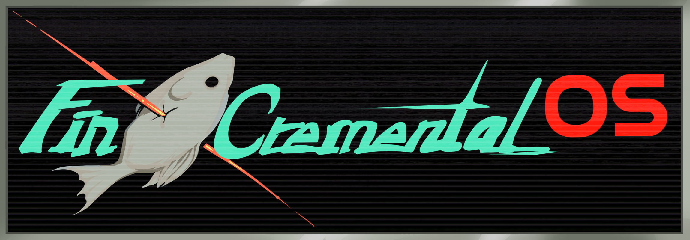
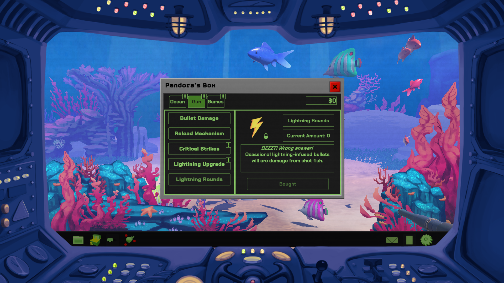

## Overview

**FincrementalOS** is an incremental game where the player shoots fish from a submarine and interacts with a simulated operating system to gain money, upgrade, and play various minigames to become stronger and gather even more fish.



**Platform:** Windows

**Role:** Lead Designer and Scrum Master

**Engine:** Unity

**Date:** September 2025 - May 2026

## My Work

I spent my time working on various operating system windows within the game. I've worked on the vacuum, email, data, and shop windows. These were made using Unity's UI Toolkit, a tool that works similarly to web development. My goal was to make our windows feel like they should fit into an OS by keeping a consistent visual style of a monochrome monitor of the 1970's and making them feel like they were built into the submarine system itself. 

I also needed to make sure the windows were easy to use and understand. Keeping buttons uniform and responsive when the player hovers their mouse over them helped players quickly grasp the mechanics of each window.

## In-Depth: The Shop

One of the systems I am very proud of is the shop, aka Pandora's Box. The shop is the main hub for player progression of various different parts of the game: Fish/Environments, the Submarine, and Minigames. Since many upgrades needed to be added over time or changed, I needed to build a system where our team could drag and drop upgrades into a list and have them immediately accessible and playable. 

To do this, our programmers made two scriptable objects: Shop Items and the Shop Database. Our team will enter all the data an upgrade needs into the Shop Item and add those items into the Shop Database. At runtime, I take that list and fill the shops with tabs depending on the types of upgrades, a list of buttons in each tab to show all available upgrades, and then a shop area with an upgrade icon, description, and a button that buys the upgrade if the player has the money for it.  

From the player's perspective, as soon as they open the shop, it's populated with the starting upgrades, and as they buy more upgrades, new ones appear. When they click a button, they get some feedback as the button's color changes. There are also some sound effects that play on the button press, when the player purchases an upgrade, and when the player tries to purchase an upgrade they don't have the money for. 

## Learnings

I've learned a lot from my year on FincrementalOS. The best habit I've gained as part of this project is the loop of creation, feedback, and applying feedback. At the beginning of the project, UI wasn't something I had much experience in. I volunteered to learn how to improve at it while also learning a new tool. During that learning process, my team gave me invaluable feedback. They went into depth of what they liked or didn't like. Some aspects that could be retained and improved and what stuff should go. 

The shop had many reworks. At first, I was given a gray box to improve, to which I added color and depth. After receiving feedback from my team, I went back to the drawing board. I created a new layout with tabs, and a small list of buttons with a small area to highlight different elements of an upgrade. I ended up making what is in the game now. Through these iterations, I made something I was far more proud of, and  I enjoyed making every moment of it. Because of my team, I feel far more confident in my abilities to make UI and the systems behind it.

## Team

**Artists:**
[Emaleigh Hunter](https://www.linkedin.com/in/emaleigh-hunter-005761187/) |
[Alanna Nguyen-Kenney](https://www.linkedin.com/in/alanna-nguyen-kenney/) |
[Coleman Fitzgerald](https://www.linkedin.com/in/coleman-fitzgerald-03b828271/)

**Designers:**
[Owen Grady](https://www.linkedin.com/in/owenrgrady/) |
[Max Schroeder](https://www.linkedin.com/in/max-schroeder-972b112b5/) |
[Alec Turgeon](https://www.linkedin.com/in/alec-turgeon/) |
[Emma Zervanos](https://www.linkedin.com/in/emma-zervanos-85742229a/)

**Programmers:**
[Benjamin Emag](https://www.linkedin.com/in/benjaminemag/) |
[Victor Diab](https://www.linkedin.com/in/victordiab/) |
[Autumn Miranda](https://www.linkedin.com/in/autumn-miranda/)

**Sound Design:**
[Meghan Bennett](https://www.linkedin.com/in/meghan-bennett-sound/)

**Production:**
[Olivier Lorin](https://www.linkedin.com/in/olivier-lorin/)

---

