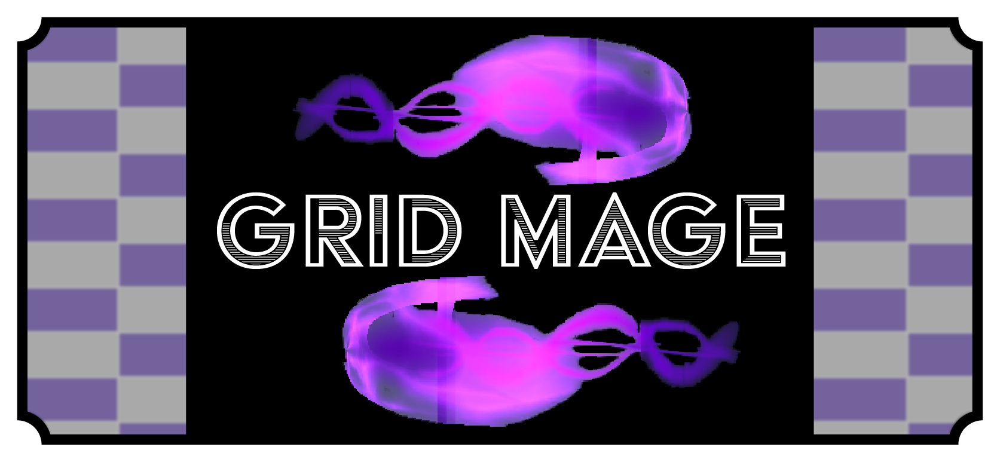

## Overview
**Grid Mage** is a turn-based boss fight made in Godot to teach me the engine and to spend more time learning how to create and implement VFX. During their turn, the player uses a grid to attack and heal. On the boss's turn, the player must dodge projectiles and lasers to defeat the boss and to win the game.

**Platform:** Windows

**Role:** Solo Dev

**Engine:** Godot

**Date:** January - May 2026

## My Work

## In-Depth: 

---