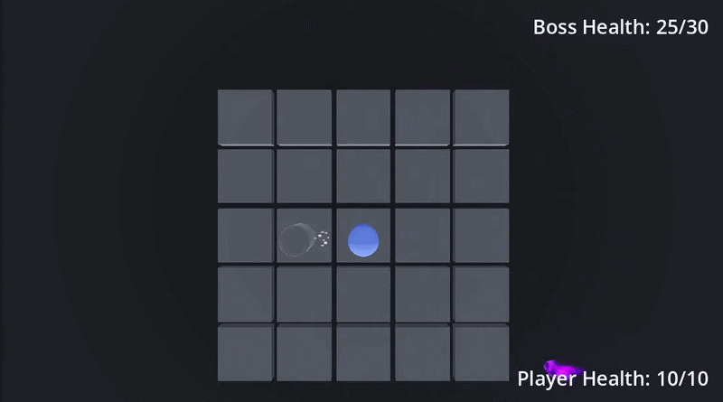
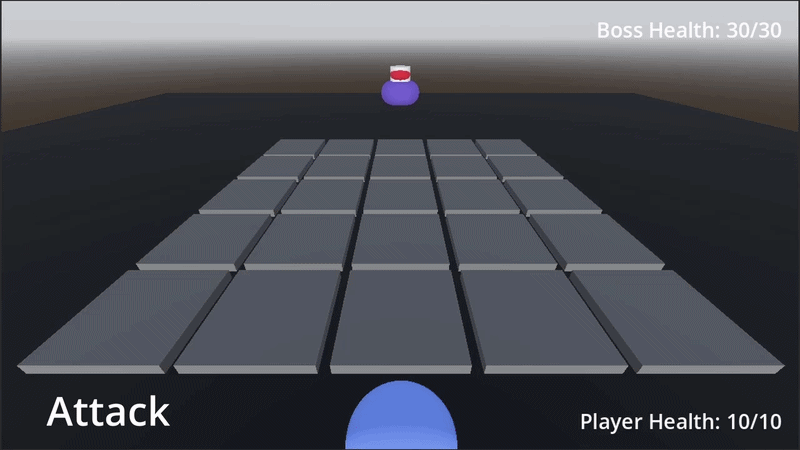
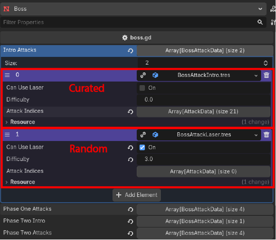

## Overview
**Grid Mage** is a turn-based boss fight made in Godot to teach me the engine and to spend more time learning how to create and implement VFX. During their turn, the player uses a grid to attack and heal. On the boss's turn, the player must dodge projectiles and lasers to defeat the boss and to win the game.

**Platform:** Windows

**Role:** Solo Developer

**Engine:** Godot

**Date:** January - May 2026

## My Work
As this project was meant to teach me Godot, I spent time reading documentation, looking at tutorials, and creating new features through trial and error. I wanted to make a project that was turn-based, on a grid, with some real-time elements. I started with the grid and the player attack, moving to the boss attack to create a full game loop. I then add VFX on top to create more game feel and to make the game feel more alive.

## In-Depth: Player Attack

For the player's attack, they can move along a grid to build up damage or healing. The more they move on the grid, the more they damage the boss or heal themselves. When they take damage to the boss's attack, the cell the player was standing on will turn purple, making it impassible for the next attack round.

## In-Depth: Boss Attack

For the boss's attack, I made two different projectiles the player has to dodge, a magic projectile that is slow and lasers that last a longer and can block off entire rows. The boss is split into two phases: The first, when the boss is above 50% health, has the player just dodging magic projectiles, and the second has the player start with dodging lasers as a little tutorial, then has both lasers and projectiles at the same time. 

These phases are created using Godot's custom resources. Each phase has a list of attacks that it either goes through or randomizes. The intro for the first and second phase go through the list, while the normal attacks for phase one and two are random with some knowledge of the last couple attacks to make sure there aren't immediate repeats. 

The random attacks use a difficulty scale to dictate the speed at which new projectiles should spawn. The curated attacks use a list of times and positions to make those attacks more difficult and to have more developer control over them.

## In-Depth: VFX

Before this project, I hadn't created my own VFX before. To create my various effects, learned how to use Godot's visual shaders, particle emitters, and animator. Using of mix of these, I was able to make multiple effects to provide more feedback and to make the attacks of the boss feel more alive. Pushing myself to try making VFX was definitely worth it, as I find myself wanting to make more of them in the future, improving along the way!

---