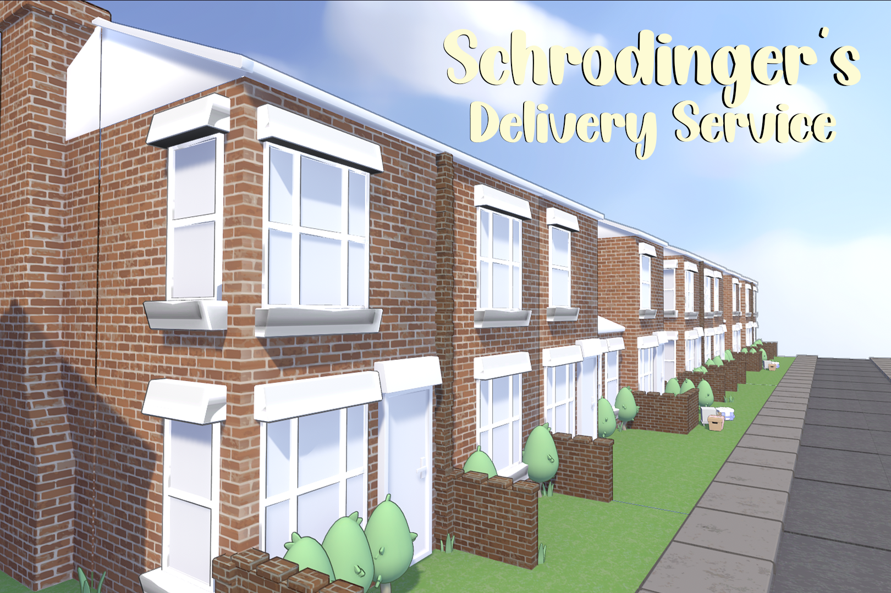

## Overview

In **Schrodinger's Delivery Service**, the player is presented with a box and must shake it to tell if a cat is inside or not. If there is a cat the player must deliver the box by throwing it at the house. If there is no cat, the player must throw the box off to the side to get a new one. 



**Platform:** PC

**Role:** System Designer

**Engine:** Unity

**Date:** Novemeber 2024

**Theme:** Hometown

### Constraints

Our game had three constraints: The game must contain physics components, the game must have a mechanic based on sound, the game must include a paradox.   

## My Work

I led my team through the 48 hours we had to make this game. In the first few hours, we decided on schrodinger's cat to be our paradox and shaking and throwing boxes to complete our sound and physics constraints. My work consisted of divying tasks and creating the shaking and throwing mechanic. Throughout my short time developing, I went through multiple iterations of the throwing mechanic. Cleaning it up to make a satisfying game mechanic.

## In-Depth: Shaking and Throwing

As the shaking and throwing was our core mechanic, I wanted to make sure it felt the best it possibly could. I started with making the clicking and dragging of the box, allowing the player to move it around the screen. I also attached it to a unity spring joint to handle moving it back to the center, but after many issues with it, I ended up having to scrap it and have it slowly move back to the middle. For the throwing, I handled the choices to either throw the box to the door or throw it away through the boxes velocity. I also added some safety colliders on the top and the left to assist with the throwing in-case of any physics errors. 

Moving the box quickly around the screen would activate the shaking. If there was a cat, you would hear a sound, if not it was safe to throw away. After the box was tossed either way, I made the next box, chosen at random from a number of boxes our artists made, move out onto the screen with a random chance of it having a cat or not. Once all of that was comeplete, I hooked throwing the box to the door to a function to move the car forward to the next house.

---

**Artists:**
[Jason Richter](https://www.linkedin.com/in/jason-t-richter/) |
[Coleman Fitzgerald](https://www.linkedin.com/in/coleman-fitzgerald-03b828271/) |
[Even Donahue](https://www.linkedin.com/in/evandonahue77/) 

**Designers:**
[Grace Gardella](https://www.linkedin.com/in/gracegardella/) |
[Max Schroeder](https://www.linkedin.com/in/max-schroeder-972b112b5/) |
[Alec Turgeon](https://www.linkedin.com/in/alec-turgeon/) |
[Elliot Mornewick](https://www.linkedin.com/in/elliot-morneweck-11742b29a/)
